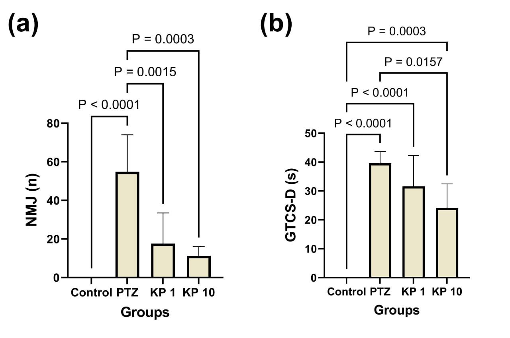
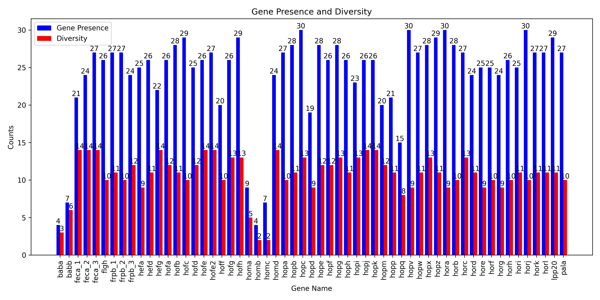
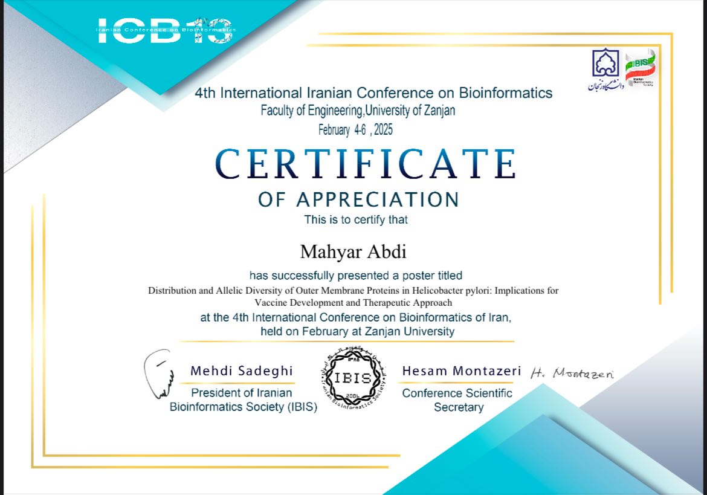
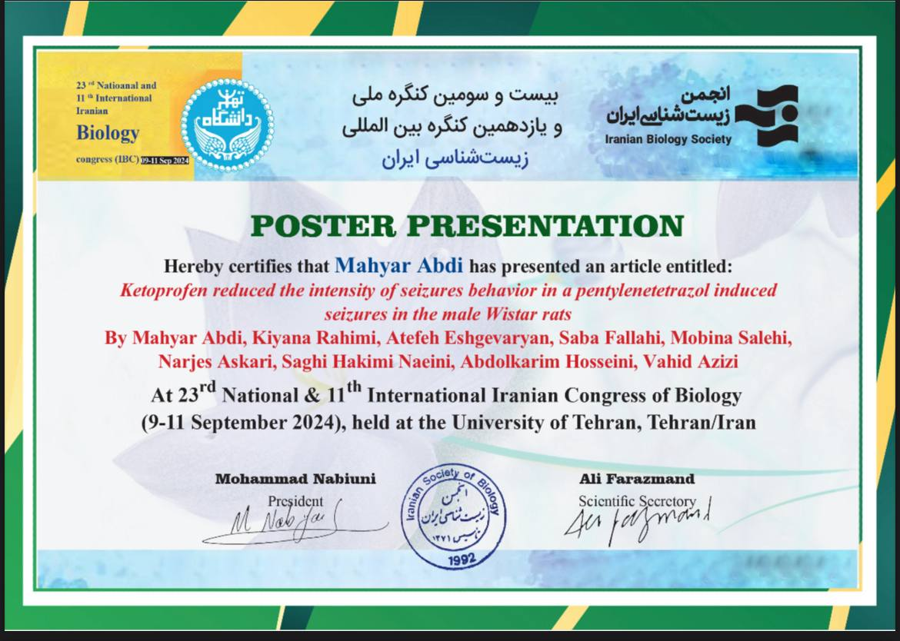
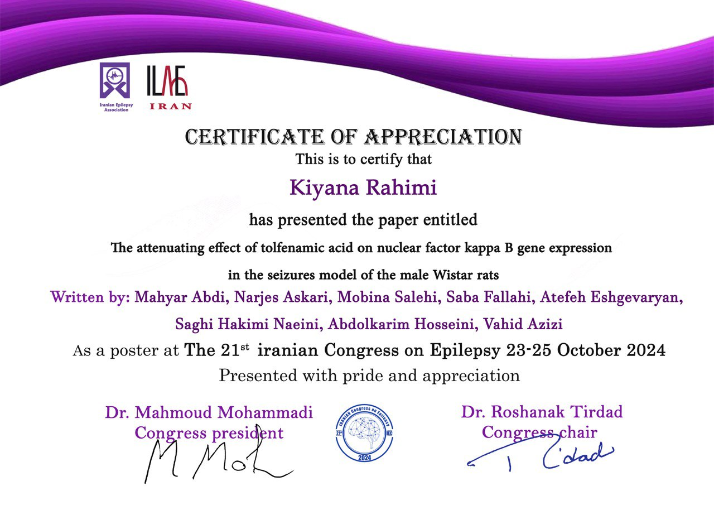
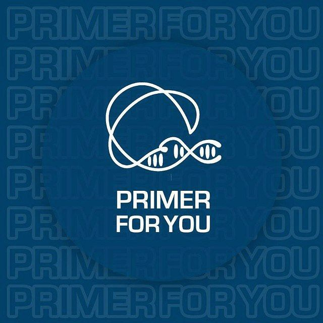

<!-- 




 -->

# About Me

I am **Mahyar Abdi**, a Biology undergraduate student at Shahid Beheshti University, Tehran, Iran.  
My research interests include **bioinformatics, neuroscience, molecular biology, genetics, and genomics**.  
Passionate about exploring the intersection of biology and computational methods.  

# Research Projects  

  

    

      Ketoprofen and Seizure Behavior in Wistar Rats
    

    
Neuroscience Research Project

    

      This study investigated the anticonvulsant potential of Ketoprofen (KP) in male Wistar rats 
      with PTZ-induced seizures. Results showed KP significantly reduced the duration and severity 
      of seizures, suggesting its potential as an anti-inflammatory therapeutic approach for seizure disorders.
    

  

  

    
  

  

    

      Distribution and Allelic Diversity of Outer Membrane Proteins in Helicobacter pylori
    

    
Bioinformatics & Genomics Research Project

    

      Our research focuses on exploring the genetic diversity of <i>Helicobacter pylori</i> outer membrane proteins (OMPs) using whole-genome sequencing. <i>H. pylori</i> infects more than half of the world’s population, and its success as a pathogen is largely due to its highly variable antigenic structures. We analyzed 30 Iranian isolates and used a custom Python-based BLAST+ pipeline to assess the presence, absence, and variation of 61 OMP genes.  

Our results revealed significant diversity among these genes, identifying over 600 novel alleles and distinct distribution patterns. Some genes, such as <i>hopC</i> and <i>horA</i>, were universally present, while others like <i>babC</i> and <i>hopU</i> were completely absent. These findings highlight the strong evolutionary pressures acting on OMPs and their roles in adaptation, immune evasion, and antibiotic resistance.  

This study provides valuable insights into the molecular evolution of <i>H. pylori</i> and identifies potential targets for developing new therapeutic and vaccine strategies, particularly relevant for high-prevalence regions such as Iran.

    

  

  

    
  

# Education

  

    

      <strong>Sep 2021 - Now</strong> 
      Bachelor, Biology , Shahid Beheshti Univeristy, Tehran, Iran
    

  

  

    
  

# Conference Presentations  

  

    

      4th International Iranian Conference on Bioinformatics
    

    
Poster Presentation

    

      *Distribution and Allelic Diversity of Outer Membrane Proteins in Helicobacter pylori: Implications for Vaccine Development and Therapeutic Approach*  
      Faculty of Engineering, University of Zanjan — February 4-6, 2025
    

  

  

    
  

  

    

      23rd National & 11th International Iranian Congress of Biology
    

    
Poster Presentation 

    

      *Ketoprofen reduced the intensity of seizure behavior in a PTZ-induced seizure model in male Wistar rats*  
      University of Tehran, Tehran, Iran — September 9-11, 2024
    

  

  

    
  

  

    

      21st Iranian Congress on Epilepsy
    

    
Poster Presentation(Co-Author)

    

      *Ketoprofen alleviates seizure by downregulating NF-κB gene expression in male Wistar rats*  
      Tehran, Iran — October 23-25, 2024
    

  

  

    
  

  

    

      21st Iranian Congress on Epilepsy
    

    
Poster Presentation(Co-Author)

    

      *The attenuating effect of tolfenamic acid on NF-κB gene expression in the seizure model of male Wistar rats*  
      Tehran, Iran — October 23-25, 2024
    

  

  

    
  

# Experience

  

    

      Shahid Beheshti University
    

    
 Research Assistant 

    
June 2023 - Now

  

  

    
  

  

    

      Shahid Beheshti University
    

    
Teaching Assistant 

    
Sep 2024 - Now

  

  

    
  

  

    

      Primer Journl
    

    
Head writer

    
Jul 2021 - Nov 2023

  

  

    
  

# Courses

# Hobbies

The principle I live by is *Kaizen* — the Japanese philosophy of constant improvement.  
I believe that every day is an opportunity to grow, even if it is only by 1%. It’s not about being invincible, it’s about being unstoppable.  

In my free time, I embrace this mindset through sports, trekking in nature, and photography, as well as writing and reading.  
Each activity is a reminder that small, consistent steps can lead to lasting strength, creativity, and balance in life.  

Here are some of my works:

<<<<<<< HEAD
  
  
  
  
=======
  
  
  
  
>>>>>>> 277bc54351f4e1e66e863375f6dbec5d75efd081

  In case you’re curious, you can explore more of my adventures and photography on 
  <a href="https://unsplash.com/@mahyar789  " target="_blank">Unsplash</a>.

<!--  -->

 
 
 
 
